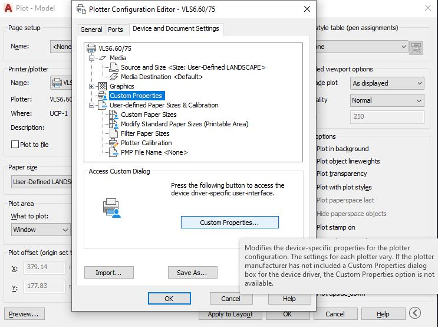

---

## Root Cause

This error usually happens after the rotary engraving fixture's been plugged in and out. This could also happen due to using **previous plot** and configuration is not changed to the one you desire. The z axis needs to be recalibrated after using the rotary fixture.

## Fix

Always check when using **previous plot** (to see if the configuration and settings match what you want to do.)

##### To Create a Rotary Engraving Configuration

Please refer to [Rotary Engraving Configuration](https://irep-air.netlify.app/machines/denfordlasercutter/rotary/)

##### To Create a Cutting Configuration

1. Open your design in AutoCAD, send it to print. Click **Properties** --> **Custom Properties**, shown as below. 

2. Change the **Figure Type** to **None**, and select other appropiate settings such as material thickness. Press **Apply** and **OK** to save the configuration.

##### Calibrating Cutting Configuration

Place the calibration focus tool on the cutting table (honeycomb bed). Go to **System** tab and click cutting table calibration, adjust the Z axis level until the notch on the calibration focus tool match with the laser nozzle assembly, click **save**, the position of calibration focus tool is shown below. 

#### Now you can swap the settings from cutting to rotary engraving anytime! Vice versa.

---

##### If have any other problems or still not working, please contact hardware team (Slack #hardware).